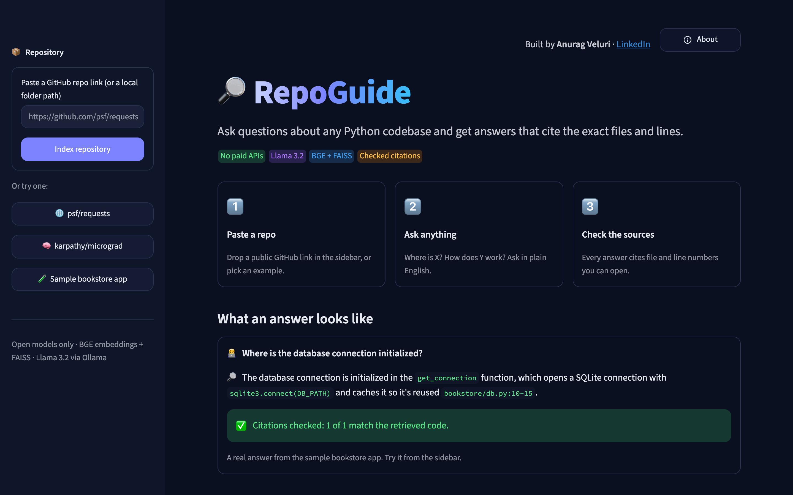
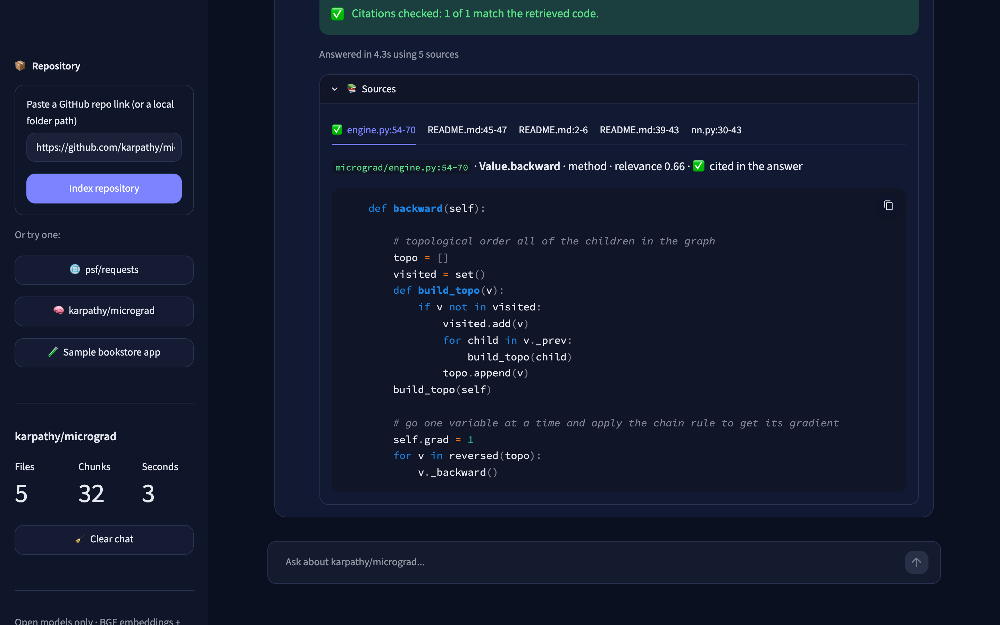

# RepoGuide

RepoGuide answers questions about a Python codebase and shows exactly which files and lines the answer came from. Point it at a local folder or any public GitHub repository. Everything runs locally on my laptop, with no paid APIs.

**Stack:** Python, Llama 3.2 (via Ollama), Hugging Face BGE embeddings, FAISS, Streamlit

> Work in progress. The full pipeline and web UI work; I'm now measuring search quality (see [Status](#status)).


*28-second demo: indexing [karpathy/micrograd](https://github.com/karpathy/micrograd) and asking how backpropagation works. [Full-quality video](docs/repoguide-demo.mp4).*

| Home | Answer with sources |
|---|---|
|  |  |

## Web UI

```bash
python -m streamlit run app/ui.py
```

Then open http://localhost:8501, paste a folder path or a GitHub URL (like `https://github.com/psf/requests`), click **Index repository**, and ask a question. The page shows the answer, whether its citations check out, and the code for each source, with cited sources opened and marked.

## Command Line Example

```bash
python -m app.ask tests/fixtures/sample_repo "where is the database connection initialized?"
```

```text
The database connection is initialized in the `get_connection` function, which is
decorated with `@functools.lru_cache(maxsize=1)`. [bookstore/db.py:10-15]

This function opens a SQLite connection using `sqlite3.connect(DB_PATH)` and returns
the connection object. [bookstore/db.py:10-15]

Citations checked: 2 of 2 match the retrieved code.
```

Every bracket is a citation you can check: `bookstore/db.py:10-15` is exactly where `get_connection` lives. RepoGuide also checks them automatically and warns about any citation that doesn't match the code the model was given. If the answer isn't in the code, RepoGuide says so instead of guessing (for example, asking how the sample app sends emails gives "I couldn't find that in the retrieved code").

The command line tools also accept GitHub URLs:

```bash
python -m app.ask https://github.com/psf/requests "How does requests handle HTTP redirects?"
```

To see just the search results without the LLM:

```bash
python -m app.retriever tests/fixtures/sample_repo "where is the database connection initialized?"
```

## How It Works

```text
Python repo (local folder, or GitHub URL -> downloaded to data/repos/)
  -> find files        skip folders like .git, .venv, node_modules
  -> split into chunks one chunk per function/class, with file + line numbers
  -> embed chunks      BGE turns each chunk into 384 numbers that capture its meaning
  -> FAISS index       finds the chunks closest to a question
  -> Llama 3.2         writes an answer using only those chunks, with citations
  -> check citations   flag any citation that isn't in the retrieved chunks
  -> Streamlit UI      answer, citation check, and the code behind each source
```

Every chunk keeps its file path and line numbers the whole way through, which is what makes citations like `bookstore/db.py:10-15` possible.

## Design Decisions

**Splitting code by function, not by character count.** I use Python's built-in `ast` module to find where each function and class starts and ends, so a search result is a complete function instead of half of one. Code outside functions (imports, constants) is kept too, and large classes are split into their methods.

**Adding the file name to what gets embedded.** Before embedding a chunk, I add a short header like `File: bookstore/db.py`. File and function names say a lot about what code does, so this helps search.

**Running BGE with ONNX Runtime instead of PyTorch.** PyTorch and FAISS crashed when used in the same program on my Mac. I traced it to both libraries bringing their own copy of the same helper library (OpenMP), which conflict. I switched to ONNX Runtime, a lighter way to run the same Hugging Face model. I checked that it gives the same numbers as PyTorch before switching, and it cut the install size by about 500 MB.

**Letting the model cite numbers, not file paths.** Llama sees the retrieved chunks as numbered sources (`Source [1] bookstore/db.py:10-15`) and cites them as `[1]`, `[2]`. My code then swaps each number for the real file and lines, so the model never writes a path or line number itself. I got here in steps:
- First I asked the model to copy labels, with the example `[src/db.py:12-29]`. It copied the `src/` folder into its answers, so 0 of 7 citations were real.
- A placeholder example (`[folder/file.py:START-END]`) fixed that on the small sample project (9 of 9), but on the real `requests` repo the model copied `START-END` literally. That approach got 10 valid and 5 broken citations on 8 questions.
- Numbered sources got 20 valid and 0 broken on the same 8 questions.

**Checking citations with simple rules instead of trusting the model.** After Llama answers, RepoGuide finds every `[file:start-end]` in the answer and checks that one of the retrieved chunks is from that file and covers those lines. If not, it prints a warning with the bad citation. It also flags malformed citations, like a source number that doesn't exist (`[7]` when there are 5 sources) or `[Retry:START-END]`. I tested it on real output: it flagged every made-up `src/` citation from my first prompt, and with numbered sources, 8 of 8 answers about `requests` passed. One limit: it checks that a citation points to code the model was shown, not that the sentence describing that code is correct.

**Downloading GitHub repos safely.** RepoGuide runs `git clone --depth 1` (latest version only) into `data/repos/` and reuses the copy next time. The URL has to match a strict `github.com/owner/repo` pattern, `--` stops anything in it from being read as a git option, and git is told never to prompt for a password, so private or misspelled repos fail with a clear message. RepoGuide only reads the downloaded files; it never runs them.

**Making indexing about 2x faster.** On real repos, indexing was slow (about 2 minutes for Flask). Each batch of 32 chunks gets padded to its longest chunk, so mixing short and long chunks wasted about half the work. Sorting chunks by length before embedding (and putting the results back in order) cut Flask from 120s to 58s with identical vectors. Repos over 3,000 chunks (about 2 minutes to index) get a clear message instead of a long wait.

**Keeping the UI separate from the logic.** `app/ui.py` only draws the page. It calls the same functions as the command line tools, so the web page can't change how search or citation checks work, and those parts stay testable without a browser.

**Keeping everything local.** Embeddings run on the CPU and Llama 3.2 runs through Ollama, so no code leaves the machine. The Streamlit server only accepts connections from the same computer, and usage stats are turned off (`.streamlit/config.toml`).

## Status

| Step | Status |
|---|---|
| File discovery + function-aware chunking | Done |
| BGE embeddings + FAISS search | Done |
| Llama 3.2 answers with citations | Done |
| Citation checking | Done |
| Streamlit UI | Done |
| Public GitHub repos | Done |
| Measuring search quality | Next |

## Setup

Requires Python 3.11+ and [Ollama](https://ollama.com) for the LLM step.

```bash
python3 -m venv .venv
source .venv/bin/activate
pip install -r requirements.txt
ollama pull llama3.2    # ~2 GB, with the Ollama app running
```

See how a repo gets split into chunks:

```bash
python -m app.chunker tests/fixtures/sample_repo
```

## Hosting It Online (Hugging Face Spaces)

RepoGuide runs on my laptop. It's also ready to host on Hugging Face Spaces: the `Dockerfile` runs Ollama (Llama 3.2) and the Streamlit app together in one container. Docker Spaces require a Hugging Face PRO account ($9/month as of September 2026), so I haven't put it online yet.

```bash
hf auth login                                   # once, with a Hugging Face access token
python scripts/deploy_space.py <hf-username>    # creates the Space "repoguide"
```

The hosted version runs with `REPOGUIDE_PUBLIC=1`, which changes a few things for safety:
- Only GitHub links are accepted. Typing a folder path would let visitors read the server's own files.
- Indexes are shared between visitors (the same repo is only indexed once), and only one repo is indexed at a time.
- At most 10 downloaded repos are kept; the least recently used are deleted.

## Tests

```bash
pytest                  # everything (first run downloads the BGE model, ~130 MB;
                        # the LLM test is skipped if Ollama isn't running)
pytest -m "not slow"    # quick tests only, no model download
```

The tests use a small sample project in `tests/fixtures/sample_repo`. The most important one checks that every line of code ends up in exactly one chunk with the correct line numbers, since wrong line numbers would mean wrong citations.

## Known Issues

- Test files sometimes rank above the code they test, because test names read like plain English.
- Very short chunks (like a one-line `__init__.py`) occasionally show up in results.
- About 11% of chunks in Flask are longer than the 512 tokens BGE can read, so their endings aren't used for search.
- The citation check confirms an answer points to code the model was shown, not that every sentence about that code is correct. Llama 3.2 (3B) sometimes adds its own reasoning.
- Repos with more than 3,000 chunks (large projects like Django) are too slow to index on a laptop CPU.
